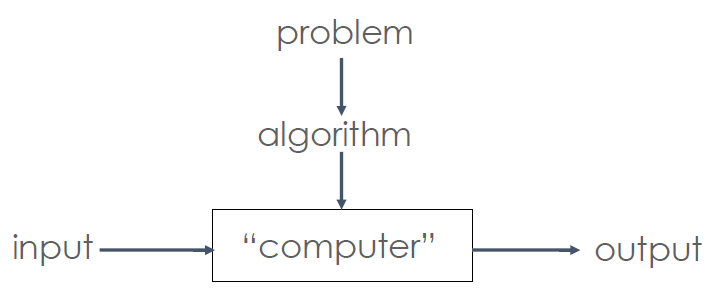
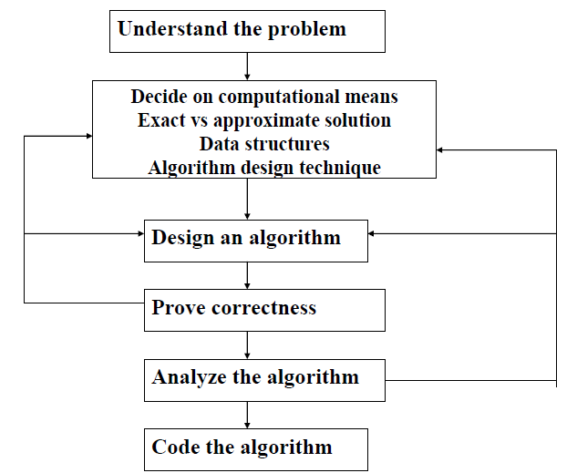

# Summary
# What is an algorithm?
* A sequence of unambiguous instructions for solving a well-defined problem. Algorithms are guaranteed to terminate if the input is valid.
* Algorithms are a subset of procedures, which aren't guaranteed to terminate.
# Terms
* Finite
    * Terminates after a finite number of steps
* Definite
    * Rigorously and unambiguously specified
* Inputs
    * Valid inputs are clearly specified
* Output
    * Can be proved to produce the correct output given a valid input
* Effective
    * Steps are sufficiently simple and basic
# Notion of an Algorithm

* Each step of the algorithm must be **unambiguous**
* The **range of inputs** must be specified carefully.
* The same algorithm can be represented in different ways AND Several algorithms for solving the same problem may exist - with different properties

# Methodology of Algorithms
1. Understand the problem
2. Decide on computational means
3. Design an algorithm
4. Prove correctness
5. Analyze the algorithm
6. Code algorithm

Another representation of the above 6 steps:

# Analyzing Algorithms
* Efficiency: time and space
* Simplicity
* Generality: range of inputs, special cases
* Optimality: no other algorithm can do better

# Types of Algorithms
* Brute Force
    * Try all possibilities
* Decrease & Conquer
    * Solve large instance in terms of smaller instance
* Divide & Conquer
    * Break problem into distinct subproblems
* Transform & Conquer
    * AKA Transformation
    * Covert problem to another one
* Trading Space & Time
    * Use additional data structures
* Dynamic Programming
    * Break problem into overlapping subproblems
* Greedy
    * Repeatedly do what is best now

# Formal Definitions - O, Ω & Θ
* Definition: *f(n) ∈ O(g(n))* iff there exists positive constant c and non-negative integer n0 such that 
    ** f(n) <= c g(n)* for every n >=n0
* Definition: *f(n) ∈ Ω(g(n))* iff there exist positive constant c and non-negative integer n0 such that
    * *f(n) >= c g(n)* for every n >= n0
* Definition: *f(n) ∈ Θ(g(n))* iff there exist positive constants c1 and c2 and non-negative integer n0 and non-negative integer n0 such that 
    * *c1 g(n) <= f(n) <= c2 g(n)* for every n >= n0

* O(g(n)): functions that grow no faster than g(n)
* Ω(g(n)): functions that grow at least as fast as g(n)
* Θ(g(n)): functions that grow at same rate as g(n)

* O(g(n)): functions no worse than g(n)
* Ω(g(n)): functions at least as bad as g(n)
* Θ(g(n)): functions as efficient as g(n)

## O vs Θ
* O is an upper bound on performance
* Θ is a tight bound
    * It is the upper and lower bound