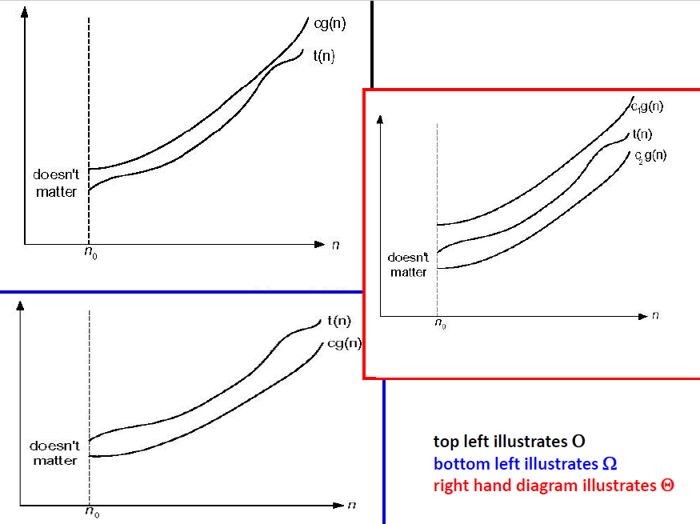
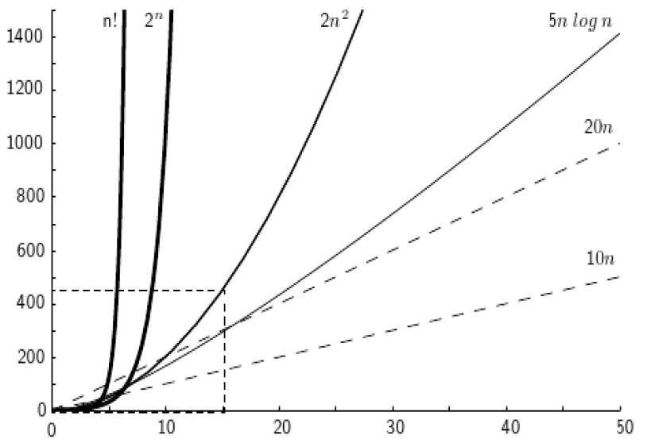
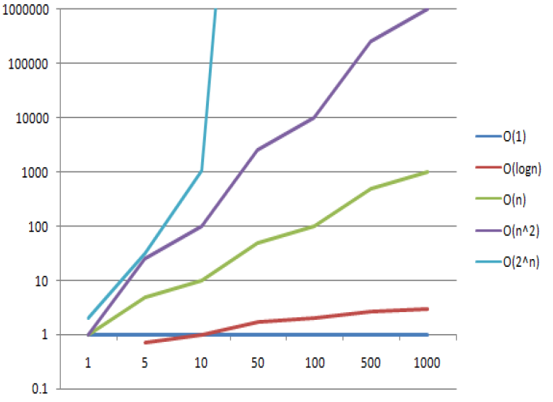

# Theory of Algorithms
# Algorithm Efficiency
* We need measures of:
    * Input size (call this n)
    * Unit of measuring time
        * The basic operation of the algorithm
* We're usually interested in growth order:
    * O(n2) vs O(n3) is more important than 1412n2 vs 5n3
* We're interested in growth order
    * So O(n2) vs O(n3) is more important than *1412*n2 vs *5*3
* We are measuring the operational complexity
* Interested in the
    * Worst case
    * Average case
    * Best case

**Example: linear search**
What are the cases?
* worst = n
    * Looks at all n elements in the array
* average = n/2
    * On average it will look at n/2 elements before finding the element being searched
    * Therefore n/2. but the 1/2 is a constant, so it is simply left as n
* best = constant time, or O(1) - as it nly looks at one element

Generally most interested in worst case. If the best case is good enough, we are interested in that

## Typical Algorithm Efficiency Classes

# Big O - Intuitively
* Algorithm executes
    * `2n+10` operations
    * We are not interested in the 2 or the 10. This is simply O(n)
* Algorithm executes:
    * 3n2 + 9n + 5
    * Not interested in the 3, 9n or 5. This is O(n2)

**Example**
* Laptop sorts array of 100 million items in 30 seconds using:
    * n*logn = 2 657 542 476 -> 30 seconds
    * n = 10 000 000 000 000 000 = 1016 
    * 1016 / 2 657 542 476 = 3762875
    * 3762875 x 30 seconds = 112 886 248s
    * 3.5 years
* Insertion sort and Bubblesort are impractical for large data sets

# Definition Big O
A function t(n) ∈ of O(g(n))

If there is a c and an n0 such that t(n) <= cg(n) for all n>=n0.
* Example 1: 100n+5 ∈ of O(n)
    * Set c to 101 and n0 to 6. Then prove that 100n+5 <=101n for all n >=6 Simple to prove with induction
* Example 2: 100n+5 ∈ O(n2)
    * Set c = 21 and n0 = 5. So prove that 100n+5<=21n2

**Example**

100n+5 element O(n)
set say c to 101 and n0 to 6
Prove 100n+5 <= 100n for all n>=6 by induction

# Omega Ω (Not important)
* A function t(n) ∈ Ω(g(n)) if there is a c and an n0 such that t(n) >= cg(n) for all n >= n0
* Same as Big O, except **bigger than** instead of **smaller than** sign

# Theta Θ (Important)
* Consider sequentially summing an array
    * If the efficiency class is O(n)
    * But it is also by our definition O(n2) and O(2n) and O(nlogn)
    * It is NOT O(logn)
* Big O(n2) means the algorithm's basic operations executes in proportion to n2 or better
* How do we say that summing array's basic operation executes **exactly** proportional to n?
    * Theta Θ
* Efficiency class for summing an array is Θ(n). It is not:
    * Θ(n2) or Θ(nlogn).
    * It is precisely Θ(n)

* A function  t(n) ∈ Ω(g(n)) if there is a c1, c2 and n0 such that c2g(n) <= t(n) <= c1g(n) for all n>=n0
* Same as big O except functions in this class cannot be in a more efficient class
    * We use this a lot:
        * 100n+5 ∈ Θ(n)
        * 100n+5 ∈ O(n2)
        * But 100n + 5 is NOT ∈ Θ(n2)

* If an algorithm is in Θ(g(n)):
    * It means that the running time of the algorithm as n (input size) gets larger is proportional to g(n)
* If an algorithm is in O(g(n))
    * It means that the running time of the algorithm as n gets larger is at most proportional to g(n)

> Big Oh is NO worse

> Big Omega is oh my god

[Check this out](https://medium.com/@.RT/total-n00bs-guide-to-big-o-big-%CF%89-big-%CE%B8-aa259ae8a1c2)

# Formal Definitions - Summary
* Definition: *f(n) ∈ O(g(n))* iff there exists positive constant c and non-negative integer n0 such that 
    ** f(n) <= c g(n)* for every n >=n0
* Definition: *f(n) ∈ Ω(g(n))* iff there exist positive constant c and non-negative integer n0 such that
    * *f(n) >= c g(n)* for every n >= n0
* Definition: *f(n) ∈ Θ(g(n))* iff there exist positive constants c1 and c2 and non-negative integer n0 and non-negative integer n0 such that 
    * *c1 g(n) <= f(n) <= c2 g(n)* for every n >= n0

* O(g(n)): functions that grow no faster than g(n)
* Ω(g(n)): functions that grow at least as fast as g(n)
* Θ(g(n)): functions that grow at same rate as g(n)

* O(g(n)): functions no worse than g(n)
* Ω(g(n)): functions at least as bad as g(n)
* Θ(g(n)): functions as efficient as g(n)

# O vs Θ
* O is an upper bound on performance
* Θ is a tight bound
    * It is the upper and lower bound

**Examples**
* Average of O(n2) -> algorithms grows at most as fast as n2 with average case input
    * E.g.: Bubble sort
* Worst case of O(n3) -> algorithm grows at most as fast as n3 with its worst case
    * E.g.: brute force matrix multiplication, which is also Θ(n3)
* Best case of Θ(n) -> algorithm grows linearly in the best case
    * E.g.: sum an array
* Worst case of Ω(2n) -> algorithm grows at best exponentially in worst case
    * E.g.: Create the power set
* With practice it often becomes easy for many algorithms

# Test Your Understanding

## True or false: Θ (n + log n) = Θ (n)?

View answer

True. We can discard addition terms that are less significant.