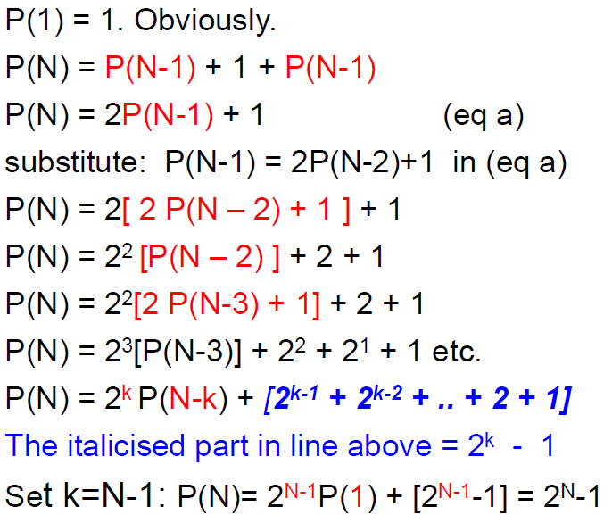
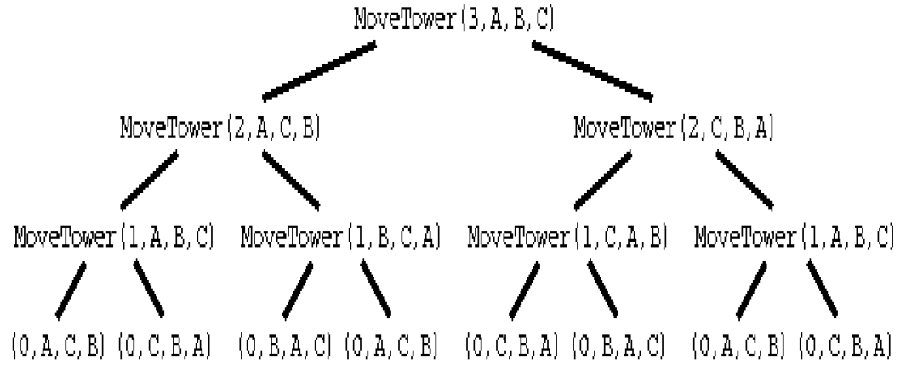
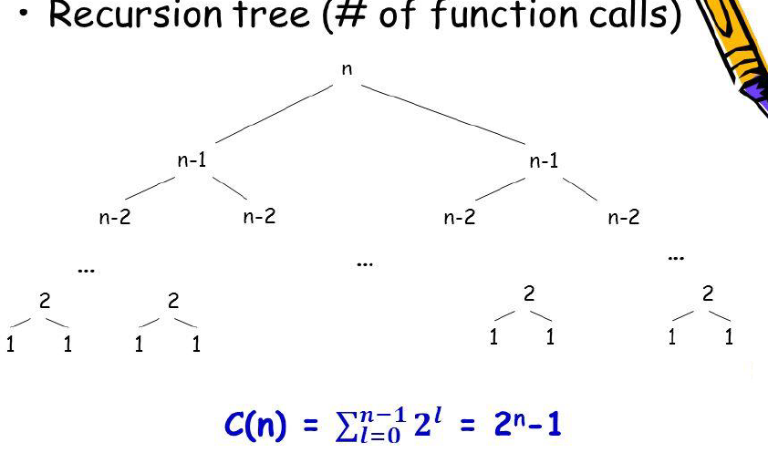
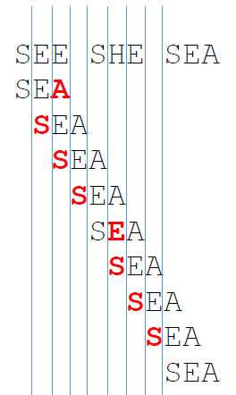
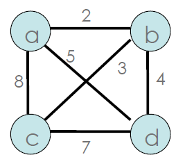
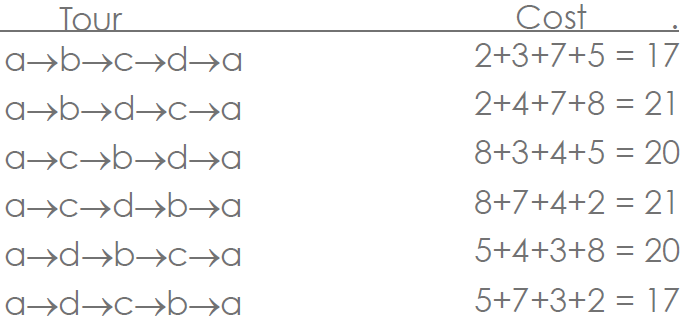

# Brute Force
Analysing a recurrence relation -> an equation or inequality that describes a function in terms of its value on smaller inputs

Some brute-force solutions:
* String matching
* Closest pair
* Convex hull
* Hamiltonian path
* Job assignment
* Knapsack problem

# Backwards Substitution:
1. Express x(n-1) successively as a function of x(n-2), x(n-3)
2. Derive x(n-j) as a function of j
3. Substitute n-j = base condition

The above equation can be solved by backward substitution:
```
M(n) = M(n-1)+1
Substitute M(n-1) = M(n-2) + 1
-> M(n) = [M(n-2) + 1]+1 = M(n-2) + 2
Substitute M(n-2) = M(n-3) + 1
    M(n) = [M(n-3) + 1] + 2 = M(n-3) + 3
-> Pattern: M(n) = M(n-j) + j
Ultimately: M(n) = M(n-n)+n = M(0) + n = n
```

# Example
```python
int Mystery(int n such that n > 0):
    if n == 1:
        return 1
    else:
        return 1 + Mystery(n/2)
```

It cuts the search space in half:
```python
int countBits(int n such that n > 0):
    if n == 1:
        return 1
    else:
        return 1 + countBits(n/2)
```
This is the addition of 1 on each call to countBits.

A(1) = 0 the addition doesn't take place when n = 1

A(n) = A(n/2) + 1 for n > 1

Now let n = 2<sup>k</sup> which is the same as saying k = log<sub>2</sub>n

n/2 = 1/2*2<sup>k</sup> = 2<sup>-1</sup> * 2<sup>k</sup> = 2<sup>k-1</sup>

A(1) = A(2<sup>0</sup>) = 0

A(n) = A(2<sup>k</sup>) = A(2<sup>k-1</sup>) + 1 for k > 0

=[A(2<sup>k-2</sup>)+1]+1 = A(2<sup>k-2</sup>) + 2

=A(2<sup>k-2</sup>) + k = A(2<sup>0</sup>) + k = k = log<sub>2</sub>n ∈ Θ(logn)

# Tower of Hanoi
This will be a walkthrough of the Towers of Hanoi in order to better understand a recurrence relation.


```c++
void hanoi(int n, int source, int spare, int dest){
    if(n>0){
        hanoi(n-1, source, det, spare);
        cout << "Move disk from " << source << " to "" << dest << endl;
        hanoi(n-1,spare,source,dest);
    }
}
```
P(1) = 1, P(N) = P(N-1) + 1 + P(N-1)



Visual representation:


Output:






# Recursive Fibonacci
```python
F(n):
    if n <=1:
        return n
    else
        return F(n-1) + F(n-2)
```

* Basic operation is the addition
* Recurrence relation:
    * A(n) = A(n-1) + 1 + A(n-2)
    * A(n) ∈ Θ(1.61803<sup>n</sup>)

# Brute Force
A straightforward approach usually directly based on problem statement and definitions
* Crude but often effective
* Simple
* Widely Applicable
* Sometimes impractically slow
* Try all the possibilities until problem solved
* Loop through each possibility, check if it solves problem

## String Search
Brute force pattern match

*SEE SHE SEA* and we are searching for *SEA*



```
BruteForceStringMatch(T[0...n-1],P[0..m-1]):
//T is the text; P is the pattern we're searching for in the text

for k <- 0 to n-m do {//for reach char in T
    j <- 0
    while j < m and P[j] = T[i+j] do{
        j <- j + 1
        if j = m{
            return k;
        }
    }
}
return -1;
```

## Worst Case Brute Force
* Worst case: the search string matches every character except the last, for every iteration of the outer loop.
    * E.g.: text = "aaaaaaaaaaaaaaaaaa"
    * Search string = "aaaab"
* Let m = length of search string, n = length of text
* =m(n-m+1) character comparisons
    *  Θ(mn) for m much smaller than n (which is what happens in practice)
*  Worst case very unlikely with natural language!
*  Average case on natural language?

## String Matching
* Problem
    * Find a substring in some text that matches a pattern
    * Pattern: a string of m characters to search for
    * Text: a (long) string of n characters to search in
  
1. Align pattern at beginning of text
2. Moving left to right, compare each character of pattern to the corresponding character in text UNTIL
    * All characters are found to match (successful search):
    * A mismatch detected
3. WHILE pattern is not found and the text is not yet exhausted, realign pattern one position to the right and repeat step 2
4. 
## Closest Pair
* Problem
    * Find the two ints that are closest together in a set of 2-D points P<sub>1</sub> = (x<sub>1</sub>,y<sub>1</sub>),..,P<sub>n</sub> = (X<sub>n</sub>,Y<sub>n</sub>)
* Algorithm
```
dmin <- infinity
for i <- 1 to n-1 do
    for j <- i+1 to n do
        d <- sqrt((xi-xk)**2+(yi-yk)**2)
        if d < dmin
            dmin <- d;
            index1 <- i;
            index2 <- j;
return index1, index2
```
* Efficiency: Θ(n<sup>2</sup>)
## Convex Hull Problem
* Problem
    * Find the convex hull enclosing n 2-D points
    * Convex Hull: If S is a set of points then the Convex Hull of S is the smallest convex set containing S
    * Convex Set: A set of points in the plane is convex if for any two points P and Q, the line segment joining P and Q belongs to the set
### Brute Force
* Algorithm
    * For each pair of points p<sub>1</sub> and p<sub>2</sub>
    * Determine whether all other points lie to the same side of the straight line through p<sub>1</sub> and p<sub>2</sub>
* Efficiency
    * Efficiency: Θ(n<sup>3</sup>)
* Strengths
# Pros and Cons of Brute Force
* Strengths 
    * Wide applicability
    * Simplicity
    * Yields reasonable algorithm for some important problems and standard algorithms for simple computational tasks
    * A good yardstick for better algorithms
    * Sometimes doing better is not worth the bother
* Weakness
    * Rarely produces efficient algorithms
    * Some brute force algorithms are infeasibly slow
    * Note as creative as some other design techniques
# Exhaustive Search
* Definition
    * A brute force solution to the search for an element with a special property
    * Usually among combinatorial objects such a permutations or subsets
    * Suggests generating each and every element of the problem's domain
* Method
    1. Construct a way of listing all potential solutions to the problem in a systematic manner
        * All Solutions one by one (disqualifying infeasible ones) keeping track of the best one found so far
        * When search ends, announce the winner
# Travelling Salesman Problem
* Problem
    * Given n cities with known distances between each pair
    * Find the shortest tour that passes through all the cities exactly once before returning to the starting city
* Alternatively
    * Find shortest *Hamiltonian Circuit* in a weighted connected graph
* Example:



## Exhaustive Search Implementation

* Improvements
    * Start and end at one particular city
    * Remove tours that differ only in direction
* Efficiency
    * `(n-1)!/2 = O(n!)`
# Assignment Problem
* Assignment Problem
* n people and n jobs to be done
* Each person is assigned to do exactly one job
* Each job is assigned to exactly one person
* The cost of person i doing job j is C[i,j]
* Find a job assignment with the minimum cost

