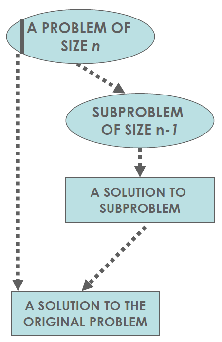
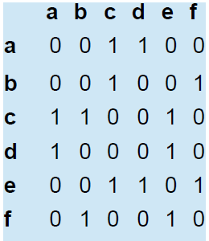
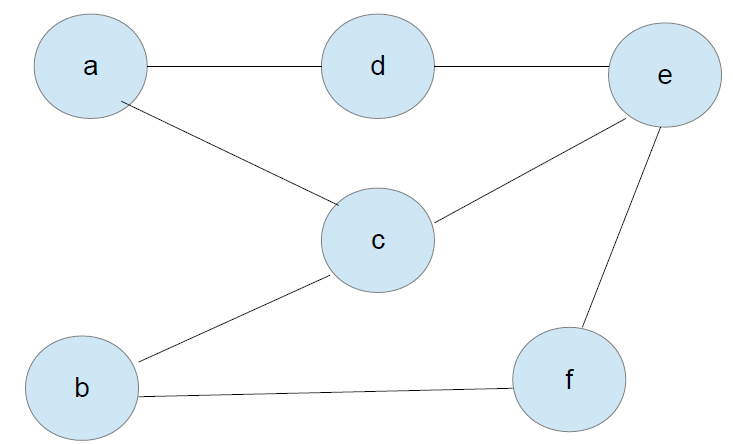
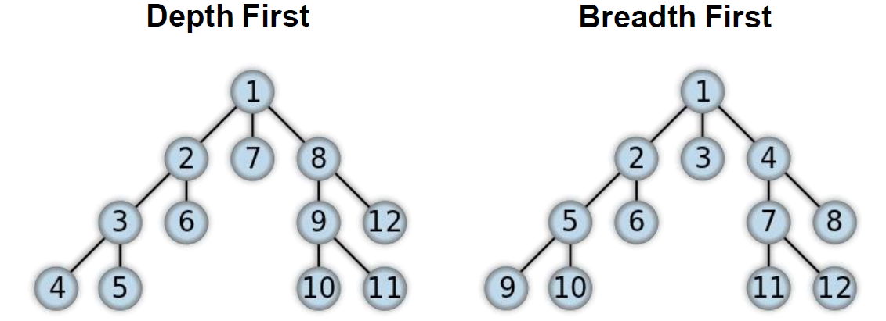

- [Decrease & Conquer](#decrease--conquer)
- [Decrease by a Constant Factor](#decrease-by-a-constant-factor)
- [Examples](#examples)
    - [Insertion Sort](#insertion-sort)
    - [Graph Searching](#graph-searching)
        - [Representing Graphs](#representing-graphs)
        - [Traversing Graphs](#traversing-graphs)
        - [Efficiency](#efficiency)
        - [Differences](#differences)
        - [Use Cases](#use-cases)
    - [Generating Permutations](#generating-permutations)
        - [Johnson Trotter Method](#johnson-trotter-method)
    - [Topological Sorting Algorithm](#topological-sorting-algorithm)
    - [Coin Problem](#coin-problem)
    - [Multiplication a la Russe](#multiplication-a-la-russe)
- [Euclid's GCD](#euclids-gcd)
    - [Variable-Size Decrease](#variable-size-decrease)
- [Finding the k'th order statistic](#finding-the-kth-order-statistic)
    - [Linear Interpolation Sort](#linear-interpolation-sort)
- [Strengths and Weaknesses of Decrease & Conquer](#strengths-and-weaknesses-of-decrease--conquer)

# Decrease & Conquer
* Decrease by a constant
* Decrease by a constant factor
* Variable size decrease

# Decrease by a Constant Factor
1. Reduce problem instance to smaller instance of the same problem and extend solution
2. Solve smaller instance
3. Extend solution of smaller instance to obtain solution to original problem
    *  Also called inductive or incremental



* Variable size decreases
# Examples
* Decrease by a constant (usually 1):
    * [Insertion sort](#insertion-sort)
    * [Graph Searching: DFS, BFS](#graph-searching)
    * [Generating permutations](#generating-permutations)
    * [Generating subsets]()
    * [Topological sort](#topological-sorting-algorithm)
* Decrease by a constant factor (usually 2):
    * Binary Search
    * Fake-coin problem
    * Multiplication a la Russe
* Variable-size decrease:
    * Euclid's algorithm
    * Interpolation Search
    * Finding the k'th order statistic e.g.: the median
## Insertion Sort

## Graph Searching
### Representing Graphs
* 2 Ways: Adjacency Matrix or Adjacency List

Adjacency Matrix
* Prefer if graph is dense
* In an undirected graph, the adjacency matrix will be symmetric (about the diagonal)
* For a weighted graph, instead of 1s you could us weights between the vertices



Adjacency List


Both of these depict the same graph:


### Traversing Graphs
* Depth First
* Breadth First

Depth First vs Breadth First



**Depth First**
```
DepthFirst(Graph G with set vertices V & edges E):
    mark all vertices with 0
    count = 0
    for each vertex v in V:
        if v is marked with 0:
            dfs(v)

dfs(v):
    ++count
    mark v with count
    for each vertex w adjacent to v:
        if w is marked with a 0:
            dfs(w)
```

Depth first search gives two orders
* Order in which nodes were visited
    * Represented by the `count` variable
* Order in which vertices were *popped* off the stack

**Breadth First**
```
BreadthFirst is identical to DepthFirst except it calls bfs instead of dfs:

bfs(v):
    ++count
    mark v with count
    create a new queue and insert v
    while the queue is not empty:
        for each vertex w adjacent to front vertex:
            if w is marked with 0:
            ++count
            mark w with count
            add w to the queue
        remove the front vertex from the queue
```
Breadth first only gives one ordering
* Order in which vertices are counted is the same as order in which they are removed from the queue

There is walthrough of both of these algorithms in the slides, I have added it to the repo [here](docs/BFS&DFS.pdf)
### Efficiency
* Both algorithms are:
    * For adjacency matrix Θ(|V|<sup>2</sup>)
    * For adjacency list: Θ(|V|+|E|)
        * |V| - number of vertices
        * |E| - number of edges
### Differences
* Depth first uses a stack
    * Implicit in recursive implementation
* Breadth first uses a queue
* Depth first creates two orderings
* Breadth first produces only one ordering

### Use Cases
* To find the fewest roads to get from point A to point B for your application?
    * Fewest roads not necessarily equal to shortest distance
        * Shortest distance is a different problem
    * Breadth first search easily finds fewest edges
* A chess program
    * There is a modification of depth-first search called MINIMAX
## Generating Permutations
* input:
    * `{1,2,3}`
* output:
    * `123 132 213 231 312 321`
* Generate all n! orderings of {1,...,n}
    * Generate all (n-1)! permutations of {1, ... ,n-1}
    * Insert n into each possible position


* If insert starting from the right or left alternately, satisfies Minimal-Change requirement (next permutation obtained by swapping two elements of previous)
* Example:
    * Start: 1
    * Insert 2: 12, 21
    * Insert 3: 123, 132, 312, 321, 231, 213

### Johnson Trotter Method
* Avoids intermediate permutations that we don't need
* Use arrows to keep track of what permutation comes next
* An element k is mobile if its arrow points to an adjacent element smaller than it
```
→ ← → ←
3 2 4 1
```
3 & 4 are mobile. 1 & 2 not.

* Initialize the first permutation with:
```
← ←     ←
1 2 ... n
```
* While last permutation has mobile element:
    * Find its largest mobile element k
    * swap k with neighbour it points to
    * reverse direction of elements > k
    * add the new permutation to the lists
* return the list of permutations

Example: given 123, find all the permutation


| | | |
|---|---|---|
|←|←|←|
|1|2|3|
|←|←|←|
|1|3|2|
|←|←|←|
|3|1|2|
|→|←|←|
|3|2|1|
|←|→|←|
|2|3|1|
|←|←|→|
|2|1|3|

Thus, we can see that the Johnson Trotter method allows us to compute the permutations without the intermediate stats.

## Topological Sorting Algorithm


* Remember that depth first search gives two orderings:
    * Order vertex pushed onto stack
    * Order popped off
* The reverse of the order in which they are popped off is topologically sorted list
* If when popping vertex v, there is an edge from u to v and u has already been popped - we have a cycle.
* In the image above, without red dashed line, popped order is: C5, C4, C3, C1, C2
* Topological ordering = C2, C1, C3, C4, C5
* Note that C1, C2, C3, C4, C5 is also a valid topological ordering

* Problem
    * Among n coins, one is fake (and weighs less)
    * We have a balance scale which can compare any two sets
* Algorithm
    * Divide into two size [n/2] piles (keeping a coin aside if n is odd)
    * If they weigh the same then the extra coin is fake
* Can we do better?
    * Decrease by factor of three

## Coin Problem
* Problem   
    * Among n coins, one is take (and weighs less)
    * We have a balance scale which can compare any two sets
* Algorithm
    * Divide into twi sizes [n/2] piles (keeping a coin aside if n is odd)
    * If they weigh the same then the extra coin is fake
    * Otherwise proceed recursively with the lighter pile
* Efficiency
    * W(n) = W(n/2) + 1 for n > 1
    * W(n) = log<sub>2</sub>n = Θ(log<sub>2</sub>n)
* Can you do better?
## Multiplication a la Russe
When someone invaded Russia they realized that the Russians did not multiply like they did, rather they used the following method:
* `n * m (n/2) * (2m)` <- even
* `((n-1)/2)*(2m)*m` <- odd

Using doubling and halving instead of multiplication is efficient in hardware as it is just shift operations.

We are decreasing the problem by a constant factor of 2 every time

# Euclid's GCD
Covered this problem initially in the [first lecture](TOA1.md), but it is a good example of Variable-Size Decrease.
## Variable-Size Decrease
* Problem
    * Greatest Common Divisor of two integers `m` and `n` is the largest integer that divides both exactly
* Alternative Solutions
    * Consecutive integer checking (brute force)
    * Identify common prime factors (transform and conquer)
* Euclid's Solution
    * `gcd(m,n) = gcd(n,m mod n)`
    * `gcd(m,0) = m`
    * Right-side args are smaller by neither a constant size nor a constant factor
* Example:
    * `gcd(60,24) = gcd(24,12) = gcd(12,0) = 12`
    * `gcd(24,60) = gcd(60,24) = gcd(24,12) = gcd(12,0) = 12`
    * This is a variable-size decrease as changing the `n` and `m` around 
# Finding the k'th order statistic
E.g.: Finding the median. Can use a decrease and 
* Finding the k'th smallest element in a list
* Sorting the list is inefficient
* We can use quicksort to partition as usual (into <= pivot and >= pivot)
* Since the pivot ends up in its correct final position, we only need to continue with one of the 2 partitions
    * if pivot ends up >= k'th position, search the first partition, else search the 2<sup>nd</sup>)
## Linear Interpolation Sort
Variable Size Decrease, depends on the particular string you are looking for.
* Mimcs the way humans search through a phone book (e.g.: looking near the beginning for 'Brown')
* Assume values between leftmost (A[l]) and rightmost (A[r]) elements increase linearly
* Algorithm (key = v, find search index = i)
    * Binary search with floating variable ad index i
    * Setup straight line through (l, A[l]) and (r,A[r])
    * Find point P = (x,y) on line at y = v, then i = x
* Efficiency:
    * Average = Θ(loglogn + 1)
    * Worst = Θ(n)


* log(logn) efficiency <- Proof

# Strengths and Weaknesses of Decrease & Conquer
Strengths
* Can be implemented either top down (recursively) or bottom up (without recursion)
* Often very efficient (possibly Θ(logn))
* Leads to a powerful form of graph traversal (breadth and depth first search)

Weakness
* Less widely applicable (especially decrease by a constant factor)